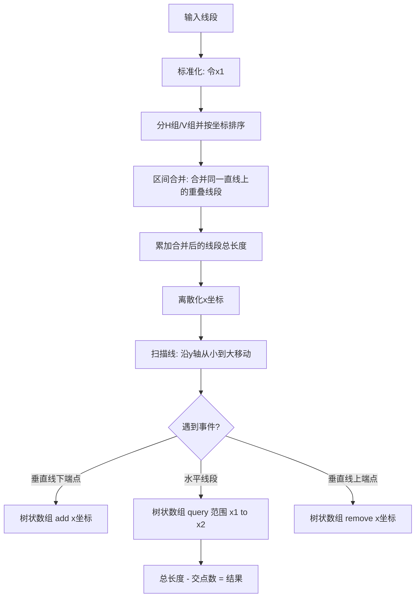

## 一、结论

**题意概括**：在无限大的方格纸上画出 $n$ 条与坐标轴平行的线段，求被覆盖到的**唯一单元格总数**（去重后的面积）。

**输入输出**：
- **输入**：线段数量 $n$，及各线段端点 $(x_1, y_1, x_2, y_2)$。
- **输出**：一个整数，代表总覆盖格子数。

---

## 二、逻辑拆解与算法流程

由于坐标范围大（$10^9$）且存在重叠，直接开数组模拟不现实。最简单且代码量小的标准做法是：**合并同向线段 + 扫描线 + 树状数组**。

### 1. 核心逻辑

1.  **分方向与合并**：将线段分为水平（H）和垂直（V）两类。对同一直线上的重叠线段进行合并（基础区间合并算法）。
2.  **总体积计算**：初步总数 = $\sum \text{所有合并后线段的长度}$。
3.  **扣除交点**：总数 = 初步总数 - (水平线段与垂直线段的交点数)。
4.  **计算交点（扫描线）**：
    -   水平线段在 $y$ 处覆盖 $[x_1, x_2]$。
    -   垂直线段在 $x$ 处覆盖 $[y_1, y_2]$。
    -   交点满足：$x \in [x_1, x_2]$ 且 $y \in [y_1, y_2]$。这是一个经典的二维数点问题。

### 2. 算法流程图



---

## 三、代码实现 (C++/ACM模式)

这是逻辑最清晰、代码最精简的实现方式，使用 `std::vector` 和 `std::sort` 处理合并，`Fenwick Tree` (树状数组) 处理交点。

```cpp
#include <iostream>
#include <vector>
#include <algorithm>

using namespace std;

struct Seg {
    int fixed, low, high; // fixed为固定轴坐标, low/high为变动轴范围
    bool operator<(const Seg& other) const {
        if (fixed != other.fixed) return fixed < other.fixed;
        return low < other.low;
    }
};

struct Event {
    int y, type, x1, x2; // type: 0 为 V起, 1 为 H, 2 为 V终
    bool operator<(const Event& other) const {
        if (y != other.y) return y < other.y;
        return type < other.type; // 必须先下端点, 再水平横线, 再上端点
    }
};

// 树状数组 (BIT)
int tree[200005], max_idx;
void update(int i, int delta) {
    for (; i <= max_idx; i += i & -i) tree[i] += delta;
}
int query(int i) {
    int s = 0;
    for (; i > 0; i -= i & -i) s += tree[i];
    return s;
}

// 合并同直线上的重叠区间
void merge_segs(vector<Seg>& v) {
    if (v.empty()) return;
    sort(v.begin(), v.end());
    vector<Seg> merged;
    for (auto& s : v) {
        if (merged.empty() || s.fixed != merged.back().fixed || s.low > merged.back().high)
            merged.push_back(s);
        else 
            merged.back().high = max(merged.back().high, s.high);
    }
    v = merged;
}

int main() {
    ios::sync_with_stdio(false); cin.tie(0);
    int n; cin >> n;
    vector<Seg> h_segs, v_segs;
    for (int i = 0; i < n; ++i) {
        int x1, y1, x2, y2; cin >> x1 >> y1 >> x2 >> y2;
        if (x1 > x2) swap(x1, x2);
        if (y1 > y2) swap(y1, y2);
        if (y1 == y2) h_segs.push_back({y1, x1, x2});
        else v_segs.push_back({x1, y1, y2});
    }

    merge_segs(h_segs);
    merge_segs(v_segs);

    long long total_cells = 0;
    vector<int> xs;
    for (auto& s : h_segs) {
        total_cells += (s.high - s.low + 1);
        xs.push_back(s.low); xs.push_back(s.high);
    }
    for (auto& s : v_segs) {
        total_cells += (s.high - s.low + 1);
        xs.push_back(s.fixed);
    }

    // 离散化 x 坐标
    sort(xs.begin(), xs.end());
    xs.erase(unique(xs.begin(), xs.end()), xs.end());
    auto get_x = [&](int x) { return lower_bound(xs.begin(), xs.end(), x) - xs.begin() + 1; };
    max_idx = xs.size();

    // 扫描线事件
    vector<Event> events;
    for (auto& s : v_segs) {
        events.push_back({s.low, 0, s.fixed, 0});
        events.push_back({s.high, 2, s.fixed, 0});
    }
    for (auto& s : h_segs) {
        events.push_back({s.fixed, 1, s.low, s.high});
    }
    sort(events.begin(), events.end());

    long long intersections = 0;
    for (auto& e : events) {
        if (e.type == 0) update(get_x(e.x1), 1);
        else if (e.type == 2) update(get_x(e.x1), -1);
        else intersections += query(get_x(e.x2)) - query(get_x(e.x1) - 1);
    }

    cout << total_cells - intersections << endl;
    return 0;
}
```

---

## 四、为什么这么做？

1.  **为什么要合并同向线段？**
    如果不合并，两条重叠的水平线段会导致交点被重复计算，逻辑会变得极其复杂。合并后，我们将问题简化为“不相交的H线段集”和“不相交的V线段集”。
2.  **为什么要用扫描线 + BIT？**
    查找一对线段是否相交是 $O(N^2)$，在 $N=10^5$ 规模下必超时。扫描线将二维问题降为一维，配合树状数组的 $O(\log N)$ 查询，使整体复杂度达到 $O(N \log N)$。
3.  **细节注意点**：
    -   **坐标包含端点**：计算长度时是 `high - low + 1`，因为题目说的是格子。
    -   **排序优先级**：在扫描线中，如果 $V$ 线段的端点和 $H$ 线段的 $y$ 轴坐标相同，必须**先处理 $V$ 的开始，再处理 $H$ 的查询，最后处理 $V$ 的结束**（代码中 `type` 分别设为 0, 1, 2 配合 `sort` 即可实现）。